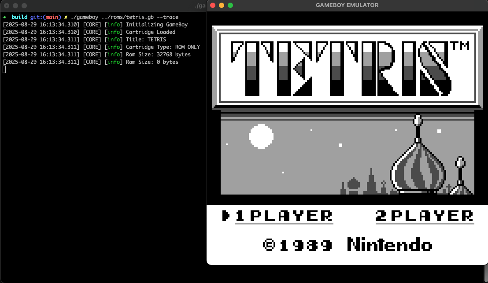
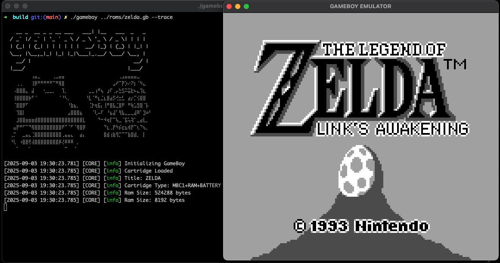
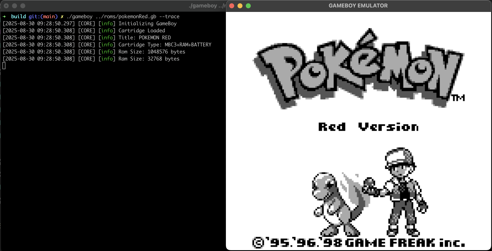

# GameBoy
DMG-01 Game Boy Emulator

This application emulates the orginal Game Boy hardware allowing users to  play Game Boy games. It has been tested with a few games such as, Pokemon Red, Tetris and Zelda's Awakening.

## Building

### Dependencies

- CMake 3.30+
- [spdlog](https://github.com/gabime/spdlog) 1.11+
- [SDL3](https://github.com/libsdl-org/SDL) 3.2+ and [SDL3_ttf](https://github.com/libsdl-org/SDL_ttf) 3.2+


```console
cmake -S . -B build -DCMAKE_BUILD_TYPE=Release
cmake --build build -j
```

## Running
```console
./gameboy ${PATH_TO_ROM} [--trace] [--loadSave] [--fastForward]
```

| Argument | Required | Description |
|----------|----------|-------------|
| `<rom_path>` | Yes | Path to the GameBoy ROM file |
| `--trace` | No | Enables debug trace mode |
| `--loadSave` | No | Loads saved game data if available |
| `--fastForward` | No | Speeds up the game when enabled |

## Testing

The CPU is tested against Blargg's `cpu_instrs` test ROMs.

```console
cmake -S . -B build-test -DBUILD_APP=OFF -DBUILD_TESTS=ON -DCMAKE_BUILD_TYPE=Release
cmake --build build-test -j
ctest --test-dir build-test --output-on-failure
```

## Controls

| Keyboard Key | GameBoy Button | Function |
|--------------|----------------|----------|
| Z            | B              | B button |
| X            | A              | A button |
| Enter/Return | Start          | Start button |
| Tab          | Select         | Select button |
| ↑ (Up)       | D-pad Up       | Move up |
| ↓ (Down)     | D-pad Down     | Move down |
| ← (Left)     | D-pad Left     | Move left |
| → (Right)    | D-pad Right    | Move right |
| S            | N/A            | Save state |
| F            | N/A            | Toggle fast forward |

## Documentation
Core components are documented under [`docs`](docs/).

## Screenshots


