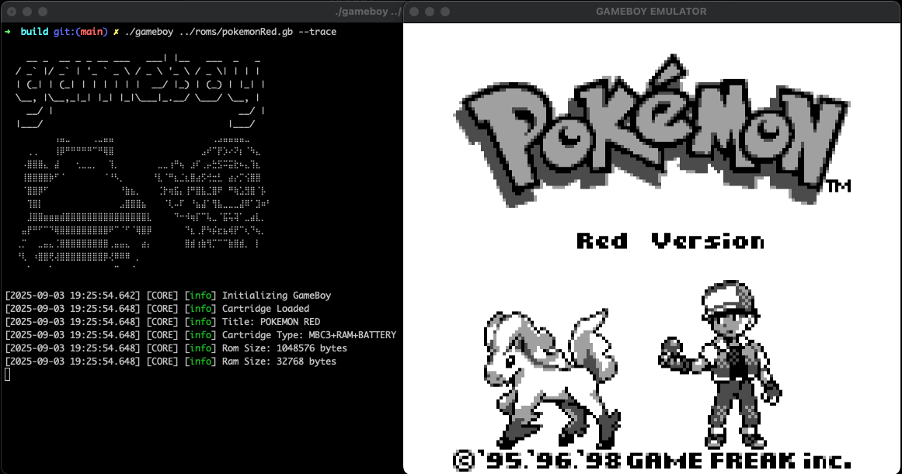

# GameBoy
DMG-01 Game Boy Emulator


## Building
```console
mkdir build && cd build
cmake ..
make
```

## Running
```console
./gameboy ${PATH_TO_ROM} [--trace] [--loadSave]
```

| Argument | Required | Description |
|----------|----------|-------------|
| `<rom_path>` | Yes | Path to the GameBoy ROM file (.gb or .gbc) |
| `--trace` | No | Enables debug trace mode |
| `--loadSave` | No | Loads saved game data if available |

## Documentation
Core components are documented under [`docs`](docs/).

## Controls

| Keyboard Key | GameBoy Button | Function |
|--------------|----------------|----------|
| Z            | B              | B button |
| X            | A              | A button |
| Enter/Return | Start          | Start button |
| Tab          | Select         | Select button |
| ↑ (Up)       | D-pad Up       | Move up |
| ↓ (Down)     | D-pad Down     | Move down |
| ← (Left)     | D-pad Left     | Move left |
| → (Right)    | D-pad Right    | Move right |
| S            | N/A            | Save state |

## Screenshots


